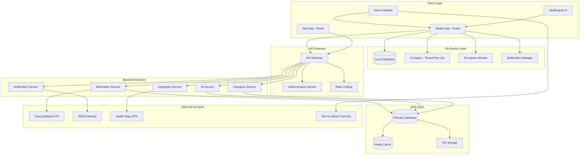

# Design Document: Medication Reminder Application

## Overview

The Medication Reminder Application is a comprehensive, cross-platform mobile and web application designed to help patients, caregivers, and elderly users manage medication schedules with AI-driven personalization and full multilingual support. The system prioritizes user accessibility, data privacy, and healthcare compliance while providing intelligent features that adapt to user behavior patterns.

The application follows a hybrid architecture combining on-device processing for privacy-sensitive operations with cloud services for synchronization and advanced AI features. The design emphasizes offline-first functionality, ensuring core reminder features work without internet connectivity.

## Architecture

### High-Level Architecture



### Technology Stack

**Frontend:**
- **Mobile**: Flutter 3.x with Dart for cross-platform iOS/Android development
- **Web**: React 18+ with TypeScript for web interface
- **State Management**: Riverpod (Flutter) / Redux Toolkit (React)
- **Local Storage**: SQLite with encryption (mobile), IndexedDB (web)

**Backend:**
- **API**: Node.js with Express.js and TypeScript
- **Database**: PostgreSQL with encryption at rest
- **Cache**: Redis for session management and frequently accessed data
- **File Storage**: AWS S3 with encryption for medication images and documents
- **Message Queue**: Redis Bull for background job processing

**AI/ML:**
- **On-Device**: TensorFlow Lite for personalization and pattern recognition
- **Cloud AI**: TensorFlow Serving for complex drug interaction analysis
- **Voice**: Platform-native speech recognition (iOS Speech, Android SpeechRecognizer)
- **TTS**: Platform-native text-to-speech with multilingual support

**Infrastructure:**
- **Cloud Provider**: AWS with HIPAA-compliant services
- **Container Orchestration**: Amazon ECS with Fargate
- **API Gateway**: AWS API Gateway with custom authorizers
- **Monitoring**: CloudWatch, Sentry for error tracking
- **CDN**: CloudFront for global content delivery

## Components and Interfaces

### Core Components

#### 1. Medication Reminder System
**Responsibilities:**
- Schedule management and reminder triggering
- Escalation logic for missed medications
- Flexible frequency and duration handling
- Offline reminder functionality

**Key Interfaces:**
```typescript
interface MedicationSchedule {
  id: string;
  medicationId: string;
  frequency: FrequencyPattern;
  duration: DurationPattern;
  timing: TimingPreferences;
  escalationRules: EscalationRule[];
  isActive: boolean;
}

interface FrequencyPattern {
  type: 'daily' | 'weekly' | 'asNeeded' | 'custom';
  interval: number;
  specificDays?: DayOfWeek[];
  timesPerDay?: number;
  customPattern?: CustomCycle;
}

interface DurationPattern {
  type: 'ongoing' | 'fixedTerm' | 'cycle';
  endDate?: Date;
  cycleDays?: number;
  breakDays?: number;
}
```

#### 2. AI Personalization Engine
**Responsibilities:**
- User behavior pattern analysis
- Optimal timing recommendations
- Proactive wellness suggestions
- On-device learning for privacy

**Key Interfaces:**
```typescript
interface PersonalizationModel {
  userId: string;
  behaviorPatterns: BehaviorPattern[];
  preferences: UserPreferences;
  recommendations: Recommendation[];
  lastUpdated: Date;
}

interface BehaviorPattern {
  type: 'snooze' | 'skip' | 'delay' | 'adherence';
  timeOfDay: number;
  dayOfWeek: number;
  frequency: number;
  confidence: number;
}
```

#### 3. Multilingual Interface
**Responsibilities:**
- Dynamic language switching
- Cultural adaptation (dates, units, icons)
- Voice command processing in multiple languages
- Text-to-speech in user's preferred language

**Key Interfaces:**
```typescript
interface LocalizationConfig {
  language: SupportedLanguage;
  region: string;
  dateFormat: DateFormat;
  timeFormat: TimeFormat;
  measurementUnit: 'metric' | 'imperial';
  currency: string;
}

interface VoiceConfig {
  language: SupportedLanguage;
  voice: VoiceProfile;
  speechRate: number;
  pitch: number;
}
```

#### 4. Medication Database
**Responsibilities:**
- Medication information storage and retrieval
- Barcode scanning and auto-population
- Image management
- Search and autocomplete functionality

**Key Interfaces:**
```typescript
interface Medication {
  id: string;
  name: string;
  genericName?: string;
  dosage: Dosage;
  form: MedicationForm;
  manufacturer?: string;
  ndc?: string; // National Drug Code
  images: MedicationImage[];
  userNotes?: string;
  purpose?: string;
  sideEffects?: string[];
  interactions?: DrugInteraction[];
}

interface Dosage {
  amount: number;
  unit: DosageUnit;
  strength?: string;
}
```

#### 5. Caregiver Portal
**Responsibilities:**
- Secure data sharing with configurable permissions
- Emergency contact management
- Adherence monitoring and alerts
- Audit logging for access control

**Key Interfaces:**
```typescript
interface CaregiverAccess {
  id: string;
  caregiverId: string;
  patientId: string;
  permissions: Permission[];
  emergencyContact: boolean;
  accessLevel: 'view' | 'manage';
  expirationDate?: Date;
  isActive: boolean;
}

interface Permission {
  resource: 'medications' | 'schedules' | 'adherence' | 'reports';
  actions: ('read' | 'write' | 'delete')[];
}
```

## Data Models

### Core Data Entities

#### User Profile
```typescript
interface UserProfile {
  id: string;
  email: string;
  profile: {
    firstName: string;
    lastName: string;
    dateOfBirth: Date;
    timezone: string;
    emergencyContacts: EmergencyContact[];
  };
  preferences: {
    localization: LocalizationConfig;
    notifications: NotificationPreferences;
    privacy: PrivacySettings;
    accessibility: AccessibilitySettings;
  };
  healthInfo?: {
    allergies: string[];
    conditions: string[];
    insuranceInfo?: InsuranceInfo;
  };
  createdAt: Date;
  updatedAt: Date;
}
```

#### Medication Entity
```typescript
interface MedicationEntity {
  id: string;
  userId: string;
  medication: Medication;
  schedule: MedicationSchedule;
  adherenceHistory: AdherenceRecord[];
  costTracking?: CostTracking;
  refillInfo?: RefillInfo;
  isActive: boolean;
  createdAt: Date;
  updatedAt: Date;
}
```

#### Adherence Tracking
```typescript
interface AdherenceRecord {
  id: string;
  medicationId: string;
  scheduledTime: Date;
  actualTime?: Date;
  status: 'taken' | 'skipped' | 'snoozed' | 'missed';
  notes?: string;
  location?: GeolocationData;
  method: 'manual' | 'auto' | 'dispenser';
  createdAt: Date;
}
```

### Database Schema Design

**Primary Tables:**
- `users` - User profiles and authentication
- `medications` - Medication master data
- `user_medications` - User's personal medication list
- `schedules` - Medication schedules and timing
- `adherence_records` - Medication intake logging
- `caregiver_access` - Sharing permissions and access control
- `notifications` - Notification history and preferences
- `ai_models` - Personalization model data (encrypted)

**Indexing Strategy:**
- Composite indexes on `(user_id, medication_id, scheduled_time)` for adherence queries
- Partial indexes on active medications and schedules
- Full-text search indexes on medication names and descriptions

## Correctness Properties

*A property is a characteristic or behavior that should hold true across all valid executions of a system—essentially, a formal statement about what the system should do. Properties serve as the bridge between human-readable specifications and machine-verifiable correctness guarantees.*

### Property 1: Medication Reminder Configuration
*For any* valid medication data (name, dosage, frequency, duration), the system should accept and store the configuration, and support all specified duration patterns including fixed-term, ongoing, and custom cycles
**Validates: Requirements 1.1, 1.2, 1.3**

### Property 2: Reminder Escalation Sequence
*For any* missed medication reminder, the escalation system should follow the correct sequence: gentle notification → repeat reminders → optional SMS/phone escalation
**Validates: Requirements 1.6**

### Property 3: Comprehensive Multilingual Support
*For any* supported language selection, all UI elements, voice commands, TTS output, and cultural formatting (dates, units, icons) should be properly localized
**Validates: Requirements 2.1, 2.2, 2.3, 2.4, 2.5**

### Property 4: Barcode Scanning Data Population
*For any* valid prescription or product barcode, scanning should automatically populate medication details including name, dosage, and manufacturer information
**Validates: Requirements 3.1**

### Property 5: Comprehensive Data Storage
*For any* medication entry, the system should store and retrieve all specified data types: images, purpose, user notes, history, costs, effectiveness ratings, and side effects
**Validates: Requirements 3.2, 3.4, 12.1, 13.4**

### Property 6: Search and Autocomplete Functionality
*For any* medication search query, the system should return relevant suggestions with autocomplete functionality
**Validates: Requirements 3.3**

### Property 7: Supply Calculation and Refill Reminders
*For any* medication with tracked usage, the system should accurately calculate remaining doses and trigger refill reminders based on usage patterns
**Validates: Requirements 3.5**

### Property 8: Drug Interaction Detection
*For any* new medication added to an existing medication list, the system should analyze and report potential drug-drug and food-drug interactions with appropriate warnings
**Validates: Requirements 4.1, 4.2, 4.4**

### Property 9: Side Effect and Resource Information
*For any* medication, the system should display side effects with severity indicators and provide links to authoritative medical resources
**Validates: Requirements 4.3, 4.5**

### Property 10: Adherence Tracking Options
*For any* triggered reminder, the system should provide exactly the options: 'Taken', 'Skipped', 'Snoozed' and allow note-taking for missed/delayed doses
**Validates: Requirements 5.1, 5.4**

### Property 11: Adherence Reporting and Visualization
*For any* adherence data, the system should generate visual charts and reports showing missed doses, timing variations, compliance percentages, and support multiple export formats
**Validates: Requirements 5.2, 5.3, 5.5, 12.5, 15.2**

### Property 12: Permission-Based Caregiver Access
*For any* caregiver access configuration, the system should enforce the specified permissions (view-only or co-manage) and allow users to control data sharing granularly
**Validates: Requirements 6.1, 6.3, 15.4**

### Property 13: Emergency Notification Triggers
*For any* critical medication that is consistently missed beyond threshold, the system should send emergency alerts to designated contacts and log emergency medication usage
**Validates: Requirements 6.2, 11.2, 11.5**

### Property 14: Audit Logging and Consent Management
*For any* caregiver action or data sharing, the system should maintain audit logs and require explicit user consent with revocation capability
**Validates: Requirements 6.4, 6.5**

### Property 15: AI Personalization and Learning
*For any* user behavior pattern (snoozing, skipping, timing preferences), the AI should learn and suggest appropriate schedule adjustments and wellness recommendations
**Validates: Requirements 7.1, 7.2, 7.3, 7.4, 15.3**

### Property 16: Accessibility Feature Availability
*For any* user accessibility need, the system should provide large buttons, high-contrast mode, adjustable fonts, voice control, and appropriate feedback mechanisms
**Validates: Requirements 8.1, 8.3, 8.4, 8.5**

### Property 17: Data Encryption and Security
*For any* personal health data stored or transmitted, the system should use appropriate encryption (on-device for storage, end-to-end for sharing)
**Validates: Requirements 9.1, 9.3**

### Property 18: Data Portability and Deletion
*For any* user data export or deletion request, the system should allow complete data export and deletion while maintaining offline functionality
**Validates: Requirements 9.4, 9.5**

### Property 19: Cross-Platform Consistency and Synchronization
*For any* feature or data change, the system should maintain feature parity across iOS/Android/web platforms and synchronize data across multiple devices
**Validates: Requirements 10.1, 10.2, 10.3, 10.4, 10.5**

### Property 20: Emergency and Critical Medication Handling
*For any* medication marked as critical or emergency, the system should provide special alert handling, quick-access emergency screens, and rescue medication logging
**Validates: Requirements 11.1, 11.3, 11.4**

### Property 21: Cost Tracking and Insurance Management
*For any* medication expense data, the system should track costs, calculate insurance coverage differences, and provide cost information during refill reminders
**Validates: Requirements 12.2, 12.3, 12.4**

### Property 22: Medical History and Provider Integration
*For any* medication history, the system should maintain complete records with timestamps and reasons, generate provider-formatted lists, and support secure sharing via QR codes
**Validates: Requirements 13.1, 13.2, 13.3, 13.5**

### Property 23: Smart Device Integration
*For any* connected smart pill dispenser, the system should coordinate dispensing with reminders, automatically log dispensed medications, monitor supply levels, and fallback to standard reminders on device failure
**Validates: Requirements 14.1, 14.2, 14.3, 14.4, 14.5**

### Property 24: Health App Integration
*For any* health app integration, the system should sync medication events when permitted and maintain full functionality when integration is disabled
**Validates: Requirements 15.1, 15.5**

### Property 25: Educational Content and Resources
*For any* medication, the system should provide comprehensive information, educational content, visual administration guides, and personalized educational tips
**Validates: Requirements 16.1, 16.2, 16.3, 16.4, 16.5**

## Error Handling

### Error Categories and Handling Strategies

#### 1. Network and Connectivity Errors
**Strategy**: Graceful degradation with offline-first approach
- **Sync Failures**: Queue operations locally, retry with exponential backoff
- **API Timeouts**: Fall back to cached data, show appropriate user messaging
- **Partial Connectivity**: Prioritize critical operations (reminders, emergency features)

#### 2. Data Validation and Input Errors
**Strategy**: Fail-fast validation with clear user feedback
- **Invalid Medication Data**: Real-time validation with specific error messages
- **Barcode Scanning Failures**: Fallback to manual entry with guided input
- **Date/Time Conflicts**: Automatic conflict resolution with user confirmation

#### 3. AI and Personalization Errors
**Strategy**: Fallback to rule-based systems
- **Model Inference Failures**: Use default timing recommendations
- **Insufficient Data**: Provide standard medication guidance until patterns emerge
- **Pattern Recognition Errors**: Allow manual override of AI suggestions

#### 4. Hardware Integration Errors
**Strategy**: Seamless fallback to software-only operation
- **Smart Dispenser Disconnection**: Automatic fallback to standard reminders
- **Voice Recognition Failures**: Provide visual alternatives and retry mechanisms
- **Camera/Barcode Scanner Issues**: Manual entry options with validation

#### 5. Security and Privacy Errors
**Strategy**: Fail-secure with immediate user notification
- **Encryption Failures**: Block data operations until resolved
- **Authentication Issues**: Force re-authentication with secure session management
- **Data Breach Detection**: Immediate user notification and security audit

### Error Recovery Mechanisms

#### Automatic Recovery
- **Database Corruption**: Automatic backup restoration with data integrity checks
- **Cache Invalidation**: Smart cache rebuilding with priority-based loading
- **Sync Conflicts**: Conflict resolution with user preference weighting

#### User-Assisted Recovery
- **Data Export/Import**: Complete data portability for disaster recovery
- **Manual Sync**: User-initiated synchronization with progress feedback
- **Settings Reset**: Granular reset options preserving critical data

## Testing Strategy

### Dual Testing Approach

The testing strategy employs both **unit testing** and **property-based testing** as complementary approaches to ensure comprehensive coverage and correctness validation.

#### Unit Testing Focus
- **Specific Examples**: Test concrete scenarios and edge cases
- **Integration Points**: Verify component interactions and API contracts
- **Error Conditions**: Validate error handling and recovery mechanisms
- **UI Components**: Test user interface behavior and accessibility features

#### Property-Based Testing Focus
- **Universal Properties**: Verify correctness properties across all inputs
- **Data Integrity**: Ensure data consistency and validation rules
- **Business Logic**: Validate core medication management rules
- **Security Properties**: Test encryption, authentication, and access control

### Property-Based Testing Configuration

**Framework Selection**: 
- **Mobile (Flutter)**: Use `test` package with custom property generators
- **Backend (Node.js)**: Use `fast-check` library for comprehensive property testing
- **Web (React)**: Use `@fast-check/jest` for React component property testing

**Test Configuration**:
- **Minimum Iterations**: 100 iterations per property test
- **Timeout Settings**: 30 seconds for complex AI/ML property tests
- **Seed Management**: Reproducible test runs with configurable seeds

**Property Test Tagging**:
Each property-based test must include a comment referencing its design document property:
```typescript
// Feature: medication-reminder-app, Property 1: Medication Reminder Configuration
```

### Test Data Management

#### Synthetic Data Generation
- **Medication Database**: Generate realistic medication data with proper NDC codes
- **User Profiles**: Create diverse user profiles with various accessibility needs
- **Adherence Patterns**: Generate realistic medication-taking behaviors
- **Multilingual Content**: Test with actual translations and cultural variations

#### Privacy-Preserving Testing
- **Data Anonymization**: Remove all PII from test datasets
- **Synthetic Health Data**: Generate HIPAA-compliant test health information
- **Secure Test Environments**: Isolated testing with production-equivalent security

### Performance and Load Testing

#### Performance Benchmarks
- **Reminder Delivery**: < 1 second from scheduled time to notification
- **Barcode Scanning**: < 3 seconds from scan to data population
- **AI Recommendations**: < 2 seconds for personalization suggestions
- **Cross-Platform Sync**: < 5 seconds for data synchronization

#### Load Testing Scenarios
- **Concurrent Users**: Test with 10,000+ simultaneous users
- **Reminder Volume**: Handle 1M+ daily reminders across user base
- **Data Synchronization**: Test sync performance with large datasets
- **Emergency Notifications**: Ensure emergency alerts work under high load

### Compliance and Security Testing

#### HIPAA Compliance Validation
- **Data Encryption**: Verify all PHI is encrypted at rest and in transit
- **Access Controls**: Test role-based permissions and audit logging
- **Data Retention**: Validate data lifecycle management and deletion
- **Breach Detection**: Test security monitoring and incident response

#### Accessibility Testing
- **Screen Reader Compatibility**: Test with VoiceOver (iOS) and TalkBack (Android)
- **Voice Control**: Validate hands-free operation across all features
- **Visual Accessibility**: Test high-contrast mode and font scaling
- **Motor Accessibility**: Ensure large touch targets and gesture alternatives

### Continuous Integration and Testing

#### Automated Test Pipeline
- **Pre-commit Hooks**: Run unit tests and linting before code commits
- **Pull Request Validation**: Execute full test suite including property tests
- **Nightly Builds**: Run extended property tests with higher iteration counts
- **Release Validation**: Comprehensive testing including manual accessibility review

#### Test Environment Management
- **Staging Environment**: Production-equivalent environment for integration testing
- **Device Testing**: Automated testing across multiple device types and OS versions
- **Internationalization Testing**: Automated validation of all supported languages
- **Performance Monitoring**: Continuous performance regression detection

This comprehensive testing strategy ensures that the medication reminder application meets all functional requirements while maintaining high standards for security, accessibility, and user experience across all supported platforms and languages.